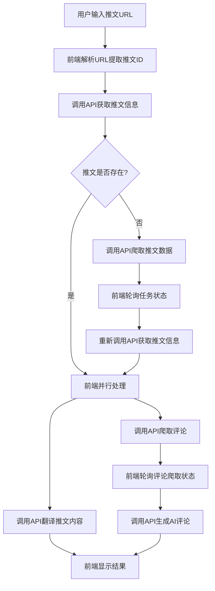

# 基于 Unicatcher API 制作独立 X-Helper 前端工具指南

## 概述

本指南面向开发独立的纯前端 X-Helper 工具，该工具通过调用 Unicatcher 项目提供的 API 来实现 Twitter/X 推文处理功能。主要功能包括推文解析、内容翻译、评论爬取和 AI 生成评论。

**重要说明**：这是一个独立的纯前端项目，不依赖 Unicatcher 的后端代码，仅通过 HTTP API 调用来获取服务。

## 核心功能与 API 映射

### 1. 推文 URL 解析
**功能描述**：从 Twitter/X URL 中提取推文 ID
**API 端点**：`POST /api/tweet-processor/parse-url`

#### 请求参数
```json
{
  "url": "https://x.com/username/status/1234567890"
}
```

#### 响应格式
```json
{
  "success": true,
  "data": {
    "originalUrl": "https://x.com/username/status/1234567890",
    "tweetId": "1234567890",
    "normalizedUrl": "https://x.com/i/status/1234567890"
  }
}
```

#### 支持的 URL 格式
- `https://x.com/username/status/1234567890`
- `https://twitter.com/username/status/1234567890`
- `https://mobile.twitter.com/username/status/1234567890`
- `https://x.com/i/status/1234567890`

### 2. 推文信息获取
**功能描述**：获取推文的详细信息，包括内容、作者、统计数据等
**API 端点**：`GET /api/tweet-processor/tweet-info/{tweetId}`

#### 请求示例
```
GET /api/tweet-processor/tweet-info/1234567890
```

#### 响应格式
```json
{
  "success": true,
  "data": {
    "id": "1234567890",
    "content": "推文内容",
    "userNickname": "用户昵称",
    "userUsername": "用户名",
    "profileImageUrl": "头像URL",
    "replyCount": 10,
    "retweetCount": 5,
    "likeCount": 100,
    "viewCount": 1000,
    "publishedAt": 1640995200000,
    "publishedAtFormatted": "2022-01-01 12:00:00",
    "translatedContent": "翻译内容（如果已翻译）",
    "isTranslated": true,
    "originalLanguage": "en",
    "commentCount": 15,
    "recentComments": []
  }
}
```

### 3. 推文数据爬取/更新
**功能描述**：当推文不在数据库中时，爬取推文数据
**API 端点**：`POST /api/tweet-processor/update`
**认证要求**：需要 `x-api-key` 头部

#### 请求参数
```json
{
  "tweetId": "1234567890",
  "force": false
}
```

#### 请求头
```
x-api-key: unicatcher-api-key-2024
```

#### 响应格式
```json
{
  "success": true,
  "message": "推文更新任务已提交",
  "data": {
    "taskId": "task_abc123",
    "tweetId": "1234567890",
    "force": false,
    "submittedAt": "2024-01-01T12:00:00.000Z"
  }
}
```

### 4. 内容翻译

#### 4.1 独立翻译 API
**功能描述**：翻译任意文本内容
**API 端点**：`POST /api/tweet-processor/translate`

##### 请求参数
```json
{
  "content": "要翻译的内容",
  "targetLanguage": "zh-CN",
  "aiConfig": {
    "apiKey": "your-api-key",
    "provider": "zhipu",
    "model": "glm-4.5-flash",
    "baseURL": "可选的自定义API端点"
  }
}
```

##### AI 配置选项
| 供应商 | 可用模型 |
|--------|----------|
| `openai` | `gpt-4o`, `gpt-4`, `gpt-3.5-turbo` |
| `openai-badger` | `gpt-4o-mini`, `gpt-4o`, `gpt-4`, `gpt-3.5-turbo` |
| `zhipu` | `glm-4.5-flash`, `glm-4.5`, `glm-4.5-air` |

##### 响应格式
```json
{
  "success": true,
  "data": {
    "originalContent": "原始内容",
    "translatedContent": "翻译后的内容",
    "originalLanguage": "en",
    "isTranslated": true,
    "targetLanguage": "zh-CN",
    "provider": "zhipu",
    "model": "glm-4.5-flash",
    "translatedAt": "2024-01-01T12:00:00.000Z"
  }
}
```

#### 4.2 推文翻译 API
**功能描述**：翻译数据库中的推文并保存结果
**API 端点**：`POST /api/tweet-processor/translate-tweet`

##### 请求参数
```json
{
  "tweetId": "1234567890",
  "targetLanguage": "zh-CN",
  "aiConfig": {
    "apiKey": "your-api-key",
    "provider": "zhipu",
    "model": "glm-4.5-flash"
  }
}
```

### 5. 评论爬取
**功能描述**：爬取推文的评论数据
**API 端点**：`POST /api/tweet-processor/crawl-comments`
**认证要求**：需要 `x-api-key` 头部

#### 请求参数
```json
{
  "tweetId": "1234567890",
  "incremental": false,
  "maxScrolls": 10
}
```

#### 请求头
```
x-api-key: unicatcher-api-key-2024
```

#### 响应格式
```json
{
  "success": true,
  "message": "评论爬取任务已提交",
  "data": {
    "taskId": "task_def456",
    "tweetId": "1234567890",
    "incremental": false,
    "maxScrolls": 10,
    "status": "queued",
    "submittedAt": "2024-01-01T12:00:00.000Z"
  }
}
```

### 6. AI 生成评论
**功能描述**：基于推文内容和现有评论，使用 AI 生成评论
**API 端点**：`POST /api/tweet-processor/generate-comments`

#### 请求参数
```json
{
  "tweetId": "1234567890",
  "userInfo": "用户信息（可选）",
  "systemPrompt": "自定义系统提示（可选）",
  "includeExistingComments": true,
  "commentCount": 3,
  "commentLength": "medium",
  "language": "zh-CN",
  "aiConfig": {
    "apiKey": "your-api-key",
    "provider": "zhipu",
    "model": "glm-4.5-flash"
  }
}
```

#### 参数说明
- `commentCount`: 生成评论数量 (1-7)
- `commentLength`: 评论长度 (`short`, `medium`, `long`)
- `language`: 语言 (`zh-CN`, `en-US`)
- `includeExistingComments`: 是否基于现有评论生成

#### 响应格式
```json
{
  "success": true,
  "data": {
    "comments": [
      "生成的评论1",
      "生成的评论2",
      "生成的评论3"
    ],
    "metadata": {
      "tweetId": "1234567890",
      "commentCount": 3,
      "language": "zh-CN",
      "generatedAt": "2024-01-01T12:00:00.000Z"
    }
  }
}
```

### 7. 任务状态查询
**功能描述**：查询异步任务的执行状态
**API 端点**：`GET /api/tweet-processor/status/{taskId}`
**认证要求**：需要 `x-api-key` 头部

#### 请求示例
```
GET /api/tweet-processor/status/task_abc123
x-api-key: unicatcher-api-key-2024
```

#### 响应格式
```json
{
  "success": true,
  "message": "任务状态查询成功",
  "data": {
    "taskId": "task_abc123",
    "status": "completed",
    "type": "crawl_comments",
    "progress": 100,
    "result": {
      "totalComments": 25,
      "comments": []
    },
    "startedAt": "2024-01-01T12:00:00.000Z",
    "completedAt": "2024-01-01T12:05:00.000Z"
  }
}
```

#### 任务状态
- `queued`: 排队中
- `running`: 执行中
- `completed`: 已完成
- `failed`: 失败

## 项目架构

### 前端技术栈建议
- **框架**：React/Vue/Angular（任选）
- **状态管理**：Redux/Vuex/Pinia（可选）
- **HTTP客户端**：Axios/Fetch API
- **UI库**：Ant Design/Element UI/Material-UI（可选）
- **构建工具**：Vite/Webpack/Create React App

### API 基础配置

#### 1. Unicatcher 服务器配置
```javascript
// config/api.js
const API_CONFIG = {
  baseURL: 'https://your-unicatcher-domain.com', // Unicatcher服务器地址
  apiKey: 'unicatcher-api-key-2024', // API密钥
  timeout: 30000 // 请求超时时间
};

export default API_CONFIG;
```

#### 2. HTTP 客户端封装
```javascript
// utils/http.js
import axios from 'axios';
import API_CONFIG from '../config/api.js';

const httpClient = axios.create({
  baseURL: API_CONFIG.baseURL,
  timeout: API_CONFIG.timeout,
  headers: {
    'Content-Type': 'application/json'
  }
});

// 请求拦截器：添加API密钥
httpClient.interceptors.request.use(
  (config) => {
    // 对于需要认证的端点添加API密钥
    const protectedEndpoints = ['/api/tweet-processor/crawl-comments', '/api/tweet-processor/update', '/api/tweet-processor/status'];
    const needsAuth = protectedEndpoints.some(endpoint => config.url.includes(endpoint));
    
    if (needsAuth) {
      config.headers['x-api-key'] = API_CONFIG.apiKey;
    }
    
    return config;
  },
  (error) => Promise.reject(error)
);

// 响应拦截器：统一错误处理
httpClient.interceptors.response.use(
  (response) => response,
  (error) => {
    console.error('API请求失败:', error);
    return Promise.reject(error);
  }
);

export default httpClient;
```

### 完整处理流程
以下是独立前端 X-Helper 工具的完整处理流程：



## 前端实现

### 1. API 服务封装

```javascript
// services/tweetService.js
import httpClient from '../utils/http.js';

class TweetService {
  // 解析推文URL
  static async parseUrl(url) {
    const response = await httpClient.post('/api/tweet-processor/parse-url', { url });
    return response.data;
  }

  // 获取推文信息
  static async getTweetInfo(tweetId) {
    const response = await httpClient.get(`/api/tweet-processor/tweet-info/${tweetId}`);
    return response.data;
  }

  // 爬取推文数据
  static async crawlTweetData(tweetId, force = false) {
    const response = await httpClient.post('/api/tweet-processor/update', {
      tweetId,
      force
    });
    return response.data;
  }

  // 翻译内容
  static async translateContent(content, aiConfig, targetLanguage = 'zh-CN') {
    const response = await httpClient.post('/api/tweet-processor/translate', {
      content,
      aiConfig,
      targetLanguage
    });
    return response.data;
  }

  // 翻译推文
  static async translateTweet(tweetId, aiConfig, targetLanguage = 'zh-CN') {
    const response = await httpClient.post('/api/tweet-processor/translate-tweet', {
      tweetId,
      aiConfig,
      targetLanguage
    });
    return response.data;
  }

  // 爬取评论
  static async crawlComments(tweetId, incremental = false, maxScrolls = 10) {
    const response = await httpClient.post('/api/tweet-processor/crawl-comments', {
      tweetId,
      incremental,
      maxScrolls
    });
    return response.data;
  }

  // 生成AI评论
  static async generateComments(options) {
    const response = await httpClient.post('/api/tweet-processor/generate-comments', options);
    return response.data;
  }

  // 查询任务状态
  static async getTaskStatus(taskId) {
    const response = await httpClient.get(`/api/tweet-processor/status/${taskId}`);
    return response.data;
  }

  // 轮询任务状态
  static async pollTaskStatus(taskId, maxAttempts = 30, interval = 2000) {
    let attempts = 0;
    
    while (attempts < maxAttempts) {
      try {
        const result = await this.getTaskStatus(taskId);
        
        if (result.data.status === 'completed') {
          return { success: true, data: result.data.result };
        } else if (result.data.status === 'failed') {
          return { success: false, error: result.data.errorMessage };
        }
        
        // 等待后重试
        await new Promise(resolve => setTimeout(resolve, interval));
        attempts++;
      } catch (error) {
        console.error('轮询任务状态失败:', error);
        attempts++;
        await new Promise(resolve => setTimeout(resolve, interval));
      }
    }
    
    return { success: false, error: '任务超时' };
  }
}

export default TweetService;
```

### 2. 主要处理流程

```javascript
// utils/tweetProcessor.js
import TweetService from '../services/tweetService.js';

export class TweetProcessor {
  constructor() {
    this.currentTask = null;
    this.callbacks = {
      onProgress: null,
      onComplete: null,
      onError: null
    };
  }

  // 设置回调函数
  setCallbacks(callbacks) {
    this.callbacks = { ...this.callbacks, ...callbacks };
  }

  // 主处理函数
  async processTweet(tweetUrl, aiConfigs) {
    try {
      this.updateProgress('开始处理推文...');

      // 1. 解析URL
      this.updateProgress('解析推文URL...');
      const parseResult = await TweetService.parseUrl(tweetUrl);
      if (!parseResult.success) {
        throw new Error(parseResult.error?.message || 'URL解析失败');
      }

      const tweetId = parseResult.data.tweetId;
      this.updateProgress(`推文ID: ${tweetId}`);

      // 2. 获取推文信息
      this.updateProgress('获取推文信息...');
      let tweetInfo = await TweetService.getTweetInfo(tweetId);

      // 3. 如果推文不存在，先爬取
      if (!tweetInfo.success && tweetInfo.error?.code === 'NOT_FOUND') {
        this.updateProgress('推文不在数据库中，开始爬取...');
        const crawlResult = await TweetService.crawlTweetData(tweetId);
        
        if (crawlResult.success) {
          this.updateProgress('等待推文爬取完成...');
          const pollResult = await TweetService.pollTaskStatus(crawlResult.data.taskId);
          
          if (pollResult.success) {
            this.updateProgress('推文爬取成功，重新获取信息...');
            tweetInfo = await TweetService.getTweetInfo(tweetId);
          }
        }
      }

      if (!tweetInfo.success) {
        throw new Error(tweetInfo.error?.message || '获取推文信息失败');
      }

      // 4. 并行处理翻译和评论
      this.updateProgress('开始并行处理翻译和评论...');
      const promises = [];

      // 翻译任务
      if (aiConfigs.translation) {
        promises.push(
          this.handleTranslation(tweetInfo.data.content, aiConfigs.translation)
        );
      }

      // 评论任务
      if (aiConfigs.comment) {
        promises.push(
          this.handleComments(tweetId, tweetInfo.data.content, aiConfigs.comment)
        );
      }

      const results = await Promise.allSettled(promises);
      
      // 整理结果
      const finalResult = {
        tweetInfo: tweetInfo.data,
        translation: results[0]?.value || null,
        comments: results[1]?.value || null,
        errors: results.filter(r => r.status === 'rejected').map(r => r.reason)
      };

      this.updateProgress('处理完成！');
      this.callbacks.onComplete?.(finalResult);
      
      return finalResult;

    } catch (error) {
      console.error('推文处理失败:', error);
      this.callbacks.onError?.(error);
      throw error;
    }
  }

  // 处理翻译
  async handleTranslation(content, aiConfig) {
    try {
      this.updateProgress('正在翻译内容...');
      const result = await TweetService.translateContent(content, aiConfig);
      
      if (result.success) {
        this.updateProgress('翻译完成');
        return result.data;
      } else {
        throw new Error(result.error?.message || '翻译失败');
      }
    } catch (error) {
      console.error('翻译处理失败:', error);
      throw error;
    }
  }

  // 处理评论
  async handleComments(tweetId, content, aiConfig) {
    try {
      // 第一步：爬取评论
      this.updateProgress('开始爬取评论...');
      const crawlResult = await TweetService.crawlComments(tweetId);
      
      if (!crawlResult.success) {
        throw new Error(crawlResult.error?.message || '评论爬取失败');
      }

      // 轮询爬取状态
      this.updateProgress('等待评论爬取完成...');
      const pollResult = await TweetService.pollTaskStatus(crawlResult.data.taskId);
      
      if (!pollResult.success) {
        throw new Error(pollResult.error || '评论爬取超时');
      }

      // 第二步：生成AI评论
      this.updateProgress('生成AI评论...');
      const generateResult = await TweetService.generateComments({
        tweetId,
        includeExistingComments: true,
        commentCount: 3,
        commentLength: 'medium',
        language: 'zh-CN',
        aiConfig
      });

      if (generateResult.success) {
        this.updateProgress('AI评论生成完成');
        return {
          crawledComments: pollResult.data,
          generatedComments: generateResult.data.comments,
          metadata: generateResult.data.metadata
        };
      } else {
        throw new Error(generateResult.error?.message || 'AI评论生成失败');
      }

    } catch (error) {
      console.error('评论处理失败:', error);
      throw error;
    }
  }

  // 更新进度
  updateProgress(message) {
    console.log(`[TweetProcessor] ${message}`);
    this.callbacks.onProgress?.(message);
  }
}
```

### 3. Vue 组件示例（可选）

如果你使用 Vue.js，以下是对应的组件实现：

```vue
<!-- components/XHelper.vue -->
<template>
  <div class="x-helper-container">
    <h1>X-Helper 工具</h1>
    
    <!-- 配置按钮 -->
    <div class="header-actions">
      <button @click="showConfig = true">⚙️ AI配置</button>
    </div>

    <!-- URL输入区域 -->
    <div class="input-section">
      <input
        v-model="tweetUrl"
        type="text"
        placeholder="输入推文URL"
        :disabled="isProcessing"
      />
      <button
        @click="handleProcessTweet"
        :disabled="isProcessing || !tweetUrl.trim()"
      >
        {{ isProcessing ? '处理中...' : '处理' }}
      </button>
    </div>

    <!-- 进度显示 -->
    <div v-if="progress" class="progress-section">
      <p>{{ progress }}</p>
    </div>

    <!-- 结果显示 -->
    <TaskResult v-if="currentTask" :task="currentTask" />

    <!-- AI配置弹窗 -->
    <AIConfigModal
      v-if="showConfig"
      :configs="aiConfigs"
      @save="handleConfigSave"
      @cancel="showConfig = false"
    />
  </div>
</template>

<script>
import { ref, onMounted } from 'vue';
import { TweetProcessor } from '../utils/tweetProcessor.js';
import TaskResult from './TaskResult.vue';
import AIConfigModal from './AIConfigModal.vue';

export default {
  name: 'XHelper',
  components: {
    TaskResult,
    AIConfigModal
  },
  setup() {
    const tweetUrl = ref('');
    const isProcessing = ref(false);
    const progress = ref('');
    const currentTask = ref(null);
    const showConfig = ref(false);
    const aiConfigs = ref({
      translation: null,
      comment: null
    });

    // 加载配置
    onMounted(() => {
      const savedConfigs = localStorage.getItem('x-helper-ai-configs');
      if (savedConfigs) {
        try {
          aiConfigs.value = JSON.parse(savedConfigs);
        } catch (e) {
          console.warn('配置解析失败:', e);
        }
      }
    });

    // 处理推文
    const handleProcessTweet = async () => {
      if (!tweetUrl.value.trim()) {
        alert('请输入推文URL');
        return;
      }

      if (!aiConfigs.value.translation?.apiKey || !aiConfigs.value.comment?.apiKey) {
        alert('请先配置AI服务');
        showConfig.value = true;
        return;
      }

      isProcessing.value = true;
      progress.value = '';

      const processor = new TweetProcessor();
      processor.setCallbacks({
        onProgress: (msg) => { progress.value = msg; },
        onComplete: (result) => {
          currentTask.value = result;
          isProcessing.value = false;
        },
        onError: (error) => {
          console.error('处理失败:', error);
          alert(`处理失败: ${error.message}`);
          isProcessing.value = false;
        }
      });

      try {
        await processor.processTweet(tweetUrl.value, aiConfigs.value);
      } catch (error) {
        // 错误已在回调中处理
      }
    };

    // 保存配置
    const handleConfigSave = (newConfigs) => {
      aiConfigs.value = newConfigs;
      localStorage.setItem('x-helper-ai-configs', JSON.stringify(newConfigs));
      showConfig.value = false;
    };

    return {
      tweetUrl,
      isProcessing,
      progress,
      currentTask,
      showConfig,
      aiConfigs,
      handleProcessTweet,
      handleConfigSave
    };
  }
};
</script>
```

### 3. AI 配置管理

```javascript
const aiConfigs = {
  translation: {
    apiKey: 'your-translation-api-key',
    provider: 'zhipu',
    model: 'glm-4.5-flash'
  },
  comment: {
    apiKey: 'your-comment-api-key',
    provider: 'zhipu', 
    model: 'glm-4.5-flash'
  }
};

// 保存到本地存储
localStorage.setItem('x-helper-ai-configs', JSON.stringify(aiConfigs));
```

## 错误处理

### 常见错误码
| 错误码 | 说明 | 处理建议 |
|--------|------|----------|
| `INVALID_URL` | 无效的推文URL | 检查URL格式 |
| `NOT_FOUND` | 推文不存在 | 尝试爬取推文数据 |
| `INVALID_API_KEY` | API密钥无效 | 检查认证信息 |
| `MAX_CONCURRENT_REACHED` | 并发限制 | 稍后重试 |
| `TASK_ALREADY_RUNNING` | 任务已在运行 | 等待当前任务完成 |
| `RECENTLY_UPDATED` | 最近已更新 | 使用现有数据 |

### 错误处理示例

```javascript
async function handleApiCall(apiCall) {
  try {
    const result = await apiCall();
    return result;
  } catch (error) {
    switch (error.code) {
      case 'NOT_FOUND':
        // 尝试爬取数据
        console.log('推文不存在，尝试爬取...');
        break;
      case 'MAX_CONCURRENT_REACHED':
        // 等待后重试
        console.log('并发限制，等待重试...');
        await new Promise(resolve => setTimeout(resolve, 5000));
        break;
      default:
        console.error('未知错误:', error);
    }
    throw error;
  }
}
```

## 最佳实践

### 1. 性能优化
- 并行处理翻译和评论爬取任务
- 合理设置任务轮询间隔（建议2秒）
- 缓存AI配置到本地存储
- 限制并发请求数量

### 2. 用户体验
- 显示处理进度和状态
- 提供任务重试功能
- 保存处理历史记录
- 支持任务恢复机制

### 3. 安全考虑
- 妥善保管API密钥
- 验证用户输入的URL
- 限制请求频率
- 处理敏感数据时注意隐私保护

### 4. 扩展性
- 模块化设计，便于添加新功能
- 支持多种AI供应商配置
- 可配置的处理参数
- 灵活的错误处理机制

## 项目部署

### 1. 项目结构建议
```
x-helper-frontend/
├── public/
│   ├── index.html
│   └── favicon.ico
├── src/
│   ├── components/
│   │   ├── XHelper.jsx
│   │   ├── TaskResult.jsx
│   │   └── AIConfigModal.jsx
│   ├── services/
│   │   └── tweetService.js
│   ├── utils/
│   │   ├── http.js
│   │   └── tweetProcessor.js
│   ├── config/
│   │   └── api.js
│   ├── styles/
│   │   └── XHelper.css
│   ├── App.jsx
│   └── main.jsx
├── package.json
├── vite.config.js
└── README.md
```

### 2. package.json 示例
```json
{
  "name": "x-helper-frontend",
  "version": "1.0.0",
  "description": "独立的X-Helper前端工具",
  "type": "module",
  "scripts": {
    "dev": "vite",
    "build": "vite build",
    "preview": "vite preview",
    "serve": "vite preview --port 3000"
  },
  "dependencies": {
    "react": "^18.2.0",
    "react-dom": "^18.2.0",
    "axios": "^1.6.0"
  },
  "devDependencies": {
    "@types/react": "^18.2.37",
    "@types/react-dom": "^18.2.15",
    "@vitejs/plugin-react": "^4.1.0",
    "vite": "^5.0.0"
  }
}
```

### 3. Vite 配置 (vite.config.js)
```javascript
import { defineConfig } from 'vite';
import react from '@vitejs/plugin-react';

export default defineConfig({
  plugins: [react()],
  server: {
    port: 3000,
    proxy: {
      '/api': {
        target: 'https://your-unicatcher-domain.com',
        changeOrigin: true,
        secure: true
      }
    }
  },
  build: {
    outDir: 'dist',
    sourcemap: true
  }
});
```

### 4. 部署方案

#### Vercel 部署
```bash
# 安装 Vercel CLI
npm i -g vercel

# 部署
vercel --prod
```

#### Netlify 部署
```bash
# 构建项目
npm run build

# 将 dist 目录上传到 Netlify
```

#### 自托管部署
```bash
# 构建生产版本
npm run build

# 使用任何静态文件服务器
npx serve dist -p 3000
```

### 5. 环境配置

#### 开发环境 (.env.development)
```bash
VITE_API_BASE_URL=http://localhost:3000
VITE_API_KEY=unicatcher-api-key-demo
```

#### 生产环境 (.env.production)
```bash
VITE_API_BASE_URL=https://your-unicatcher-domain.com
VITE_API_KEY=your-production-api-key
```

#### 配置文件更新
```javascript
// config/api.js
const API_CONFIG = {
  baseURL: import.meta.env.VITE_API_BASE_URL || 'https://your-unicatcher-domain.com',
  apiKey: import.meta.env.VITE_API_KEY || 'unicatcher-api-key-2024',
  timeout: 30000
};

export default API_CONFIG;
```

## 安全注意事项

### 1. API 密钥安全
- **不要**在前端代码中硬编码API密钥
- 使用环境变量进行配置
- 考虑通过用户输入获取API密钥并存储在本地

### 2. 跨域处理
```javascript
// 如果遇到跨域问题，可以在开发环境使用代理
// vite.config.js 中的 proxy 配置已处理这个问题
```

### 3. 错误信息处理
- 不要在前端暴露敏感的错误信息
- 对用户友好的错误提示

## 功能扩展建议

### 1. 批量处理
```javascript
// 支持批量处理多个推文URL
class BatchProcessor {
  async processBatch(urls, aiConfigs) {
    const results = [];
    for (const url of urls) {
      try {
        const result = await new TweetProcessor().processTweet(url, aiConfigs);
        results.push({ url, result, status: 'success' });
      } catch (error) {
        results.push({ url, error, status: 'failed' });
      }
    }
    return results;
  }
}
```

### 2. 结果导出
```javascript
// 导出处理结果为 JSON 或 CSV
export function exportResults(results, format = 'json') {
  if (format === 'json') {
    const blob = new Blob([JSON.stringify(results, null, 2)], { type: 'application/json' });
    downloadBlob(blob, 'x-helper-results.json');
  }
  // 可以添加 CSV 格式支持
}

function downloadBlob(blob, filename) {
  const url = URL.createObjectURL(blob);
  const a = document.createElement('a');
  a.href = url;
  a.download = filename;
  a.click();
  URL.revokeObjectURL(url);
}
```

### 3. 历史记录管理
```javascript
// 管理处理历史
class HistoryManager {
  static save(task) {
    const history = this.getHistory();
    history.unshift({ ...task, timestamp: Date.now() });
    localStorage.setItem('x-helper-history', JSON.stringify(history.slice(0, 50)));
  }

  static getHistory() {
    try {
      return JSON.parse(localStorage.getItem('x-helper-history') || '[]');
    } catch {
      return [];
    }
  }

  static clear() {
    localStorage.removeItem('x-helper-history');
  }
}
```

## 总结

通过本指南，你可以创建一个完全独立的纯前端 X-Helper 工具，它具备以下特点：

### 核心优势
1. **独立部署**：不依赖 Unicatcher 后端代码，可独立部署到任何静态托管服务
2. **功能完整**：包含推文解析、翻译、评论爬取和AI生成评论等完整功能
3. **用户友好**：提供清晰的界面和进度反馈
4. **可扩展性**：模块化设计，易于添加新功能

### 关键实现要点
1. **API 调用顺序**：URL解析 → 推文信息获取 → 数据爬取（如需要） → 并行处理翻译和评论
2. **异步任务管理**：合理轮询任务状态，避免阻塞用户界面  
3. **错误处理**：针对不同错误类型采取相应的处理策略
4. **配置管理**：支持多种AI供应商配置，本地存储用户设置

### 技术栈选择
- **前端框架**：React/Vue/Angular（本指南以React为主，提供Vue示例）
- **构建工具**：Vite（推荐）或 Webpack
- **HTTP客户端**：Axios
- **部署方案**：Vercel/Netlify/自托管

### 后续开发建议
1. 添加批量处理功能
2. 实现结果导出功能
3. 优化用户界面和交互体验
4. 添加更多AI模型支持
5. 实现离线缓存功能

这个独立的前端工具将为用户提供强大的Twitter/X内容处理能力，同时保持简单易用的特点。
