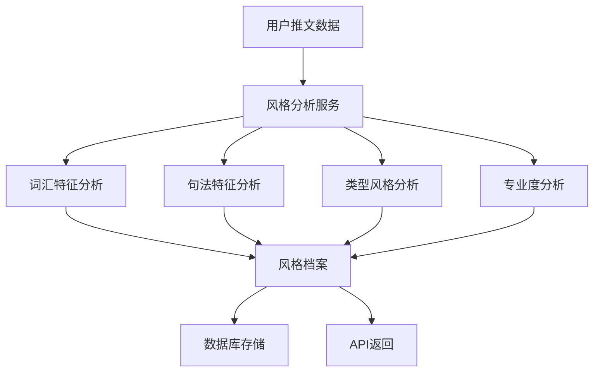

# 写作风格学习模块工作机制详解

## 🧠 核心工作流程

### 整体架构


## 📊 四大分析维度

### 1. 词汇特征分析 (Lexical Features)

**目标**: 分析用户的用词习惯和词汇特征

**具体指标**:
```typescript
lexical: {
  signatureWords: Array<{word: string, frequency: number, tfidf: number}>;
  vocabDiversity: number;    // 词汇丰富度 (TTR = unique/total)
  wordComplexity: number;    // 平均词长
  posDistribution: Record<string, number>; // 词性分布
}
```

**工作机制**:
```javascript
// 1. 文本预处理
const {words} = this.preprocessText(tweet.content);
// "今天学习了机器学习" → ["今天", "学习", "了", "机器学习"]

// 2. 词频统计
wordCounts[word] = (wordCounts[word] || 0) + 1;

// 3. TTR计算 (词汇丰富度)
const vocabDiversity = uniqueWords / totalWords;
// 例: 100个独特词汇/500个总词汇 = 0.2 (20%丰富度)

// 4. 高频词提取 (简化TF-IDF)
const signatureWords = Object.entries(wordCounts)
  .map(([word, freq]) => ({
    word,
    frequency: freq,
    tfidf: freq * Math.log(tweets.length / 1)
  }));
```

### 2. 句法特征分析 (Syntactic Features)

**目标**: 分析用户的句子结构和标点使用习惯

**具体指标**:
```typescript
syntactic: {
  avgSentenceLength: number;           // 平均句长
  sentenceTypeDistribution: {          // 句型分布
    declarative: number;    // 陈述句比例
    interrogative: number;  // 疑问句比例
    exclamatory: number;   // 感叹句比例
    imperative: number;    // 祈使句比例
  };
  punctuationPattern: {               // 标点使用模式
    exclamationDensity: number;  // 感叹号密度
    questionDensity: number;     // 问号密度
    ellipsisDensity: number;     // 省略号密度
  };
}
```

**工作机制**:
```javascript
// 1. 句子分割
const sentences = cleanedText.split(/[。！？\n]/).filter(s => s.trim().length > 0);

// 2. 句型分类
sentences.forEach(sentence => {
  if (sentence.includes('？') || /吗|呢|么/.test(sentence)) {
    sentenceTypes.interrogative++;      // 疑问句
  } else if (sentence.includes('！')) {
    sentenceTypes.exclamatory++;        // 感叹句
  } else if (/^(请|让|要|别)/.test(sentence)) {
    sentenceTypes.imperative++;         // 祈使句
  } else {
    sentenceTypes.declarative++;        // 陈述句
  }
});

// 3. 标点密度计算
punctuationCounts.exclamation += (tweet.content.match(/！/g) || []).length;
const exclamationDensity = punctuationCounts.exclamation / tweets.length;
```

### 3. 类型风格分析 (Type-Based Styles)

**目标**: 分析用户在不同推文类型下的风格差异

**具体指标**:
```typescript
typeBasedStyles: Record<string, {
  commonOpenings: string[];      // 常用开头模式
  commonClosings: string[];      // 常用结尾模式
  avgLength: number;            // 该类型的平均长度
  toneFeatures: Record<string, number>; // 语气特征
}>
```

**工作机制**:
```javascript
// 1. 获取用户的类型标注数据
const typeAnnotations = await db.tweetTypeAnnotation.findMany({
  where: { username },
  include: { tweet: true }
});

// 2. 按类型分组
typeAnnotations.forEach(annotation => {
  const types = JSON.parse(annotation.tweetTypes);
  Object.entries(types).forEach(([type, weight]) => {
    if (weight > 0.3) {  // 只考虑权重较高的类型
      typeGroups[type].push({ content: annotation.tweet.content });
    }
  });
});

// 3. 分析每个类型的特征
Object.entries(typeGroups).forEach(([type, tweets]) => {
  // 提取开头模式: "今天学习了..." → "今天学习"
  const opening = content.substring(0, Math.min(10, content.length));

  // 提取结尾模式: "...很有意思！" → "很有意思！"
  const closing = content.substring(Math.max(0, content.length - 10));

  // 语气特征分析
  const toneFeatures = {
    enthusiasm: content.match(/[！!]/g)?.length || 0,  // 热情度
    formality: content.length > 50 ? 0.1 : 0,         // 正式度
    certainty: /一定|肯定|确实/.test(content) ? 0.2 : 0, // 确定性
  };
});
```

### 4. 专业度分析 (Professional Features)

**目标**: 评估用户的专业知识水平和表达风格

**具体指标**:
```typescript
professional: {
  technicalTermUsage: number;        // 技术术语使用频率
  dataCitationStyle: {               // 数据引用风格
    usesNumbers: boolean;            // 是否使用数字
    citesPercentages: boolean;       // 是否引用百分比
    mentionsStudies: boolean;        // 是否提及研究
  };
  industryKnowledgeLevel: 'basic' | 'intermediate' | 'expert';
}
```

**工作机制**:
```javascript
// 1. 技术术语检测
words.forEach(word => {
  if (/^(算法|数据|模型|系统|架构|框架|API|SDK|分析|优化|性能)/.test(word)) {
    technicalTermCount++;
  }
});
const technicalTermUsage = technicalTermCount / totalWords;

// 2. 引用风格检测
if (/\d+%/.test(tweet.content)) {
  citationStyle.citesPercentages = true;    // "准确率提升了25%"
}
if (/研究|报告|调查|数据|显示/.test(tweet.content)) {
  citationStyle.mentionsStudies = true;    // "研究显示"
}

// 3. 知识水平判断
let industryKnowledgeLevel = 'basic';
if (technicalTermUsage > 0.1 && citationStyle.mentionsStudies) {
  industryKnowledgeLevel = 'expert';      // 高技术术语 + 引用研究
} else if (technicalTermUsage > 0.05 || citationStyle.usesNumbers) {
  industryKnowledgeLevel = 'intermediate'; // 中等技术术语或使用数据
}
```

## 🔄 完整的学习流程

### Phase 1: 数据获取
```javascript
// 获取用户推文数据 (最多500条)
const tweets = await db.writingAnalysisTweet.findMany({
  where: { userUsername: username },
  select: { content: true },
  orderBy: { publishedAt: 'desc' },
  take: 500
});
```

### Phase 2: 多维度分析
```javascript
// 并行分析四个维度
const lexical = this.analyzeLexicalFeatures(tweets);
const syntactic = this.analyzeSyntacticFeatures(tweets);
const typeBasedStyles = await this.analyzeTypeBasedStyles(username);
const professional = this.analyzeProfessionalFeatures(tweets);
```

### Phase 3: 风格档案生成
```javascript
const styleFeatures = {
  lexical,           // 词汇特征
  syntactic,         // 句法特征
  typeBasedStyles,   // 类型风格差异
  professional      // 专业度特征
};
```

### Phase 4: 数据库存储
```javascript
await db.userStyleProfile.upsert({
  where: { username },
  update: {
    signatureWords: JSON.stringify(styleFeatures.lexical.signatureWords),
    vocabDiversity: styleFeatures.lexical.vocabDiversity,
    avgSentenceLength: styleFeatures.syntactic.avgSentenceLength,
    // ... 其他字段
    updatedAt: new Date()
  }
});
```

## 📱 API接口使用

### 创建风格档案
```bash
POST /api/writing-analysis/analyze-style
{
  "username": "@testuser",
  "forceUpdate": false
}
```

### 获取风格档案
```bash
GET /api/writing-analysis/analyze-style?username=@testuser&detailed=true
```

**返回数据结构**:
```json
{
  "success": true,
  "data": {
    "username": "@testuser",
    "lastAnalyzedAt": "2024-01-01T00:00:00Z",
    "basicFeatures": {
      "vocabDiversity": 0.25,           // 词汇丰富度25%
      "wordComplexity": 2.3,           // 平均词长2.3字符
      "avgSentenceLength": 18.5,       // 平均句长18.5字符
      "technicalTermUsage": 0.08,      // 技术术语使用率8%
      "industryKnowledgeLevel": "intermediate"
    },
    "detailedFeatures": {
      "signatureWords": [
        {"word": "数据", "frequency": 15, "tfidf": 3.2},
        {"word": "分析", "frequency": 12, "tfidf": 2.8}
      ],
      "sentenceTypeDist": {
        "declarative": 0.7,    // 70%陈述句
        "interrogative": 0.2,  // 20%疑问句
        "exclamatory": 0.1     // 10%感叹句
      },
      "tweetTypeStyles": {
        "研究/数据": {
          "commonOpenings": ["数据显示", "研究表明"],
          "avgLength": 45.2,
          "toneFeatures": {"formality": 0.8, "certainty": 0.6}
        }
      }
    }
  }
}
```

## 🎯 当前系统的优势与限制

### ✅ 优势
1. **多维度分析**: 从4个不同角度分析写作风格
2. **类型差异**: 能识别用户在不同推文类型下的风格变化
3. **量化指标**: 提供可比较的数值化特征
4. **数据持久化**: 风格档案保存在数据库中

### ⚠️ 当前限制
1. **简单分词**: 依赖基础的文本分割，精度有限
2. **规则驱动**: 基于预定义规则，缺乏深度语义理解
3. **样本依赖**: 需要足够的推文数据才能准确分析
4. **静态模式**: 无法识别风格的时间演变

### 🚀 潜在改进方向
1. **集成jieba分词**: 提高词汇识别精度
2. **语义分析**: 引入情感分析、主题建模
3. **时间序列**: 追踪风格变化趋势
4. **对比分析**: 与其他用户风格进行比较

## 💡 实际应用场景

这个风格学习模块为后续的**推文生成**功能提供基础：

1. **词汇选择**: 根据用户常用词汇生成相似的表达
2. **句式模仿**: 模拟用户的句长和句型偏好
3. **语气匹配**: 保持用户的语气特征(正式/随意/热情等)
4. **类型适配**: 针对不同推文类型采用相应的风格

当前的系统已经能够有效学习和建模用户的写作风格，为个性化内容生成奠定了良好基础！